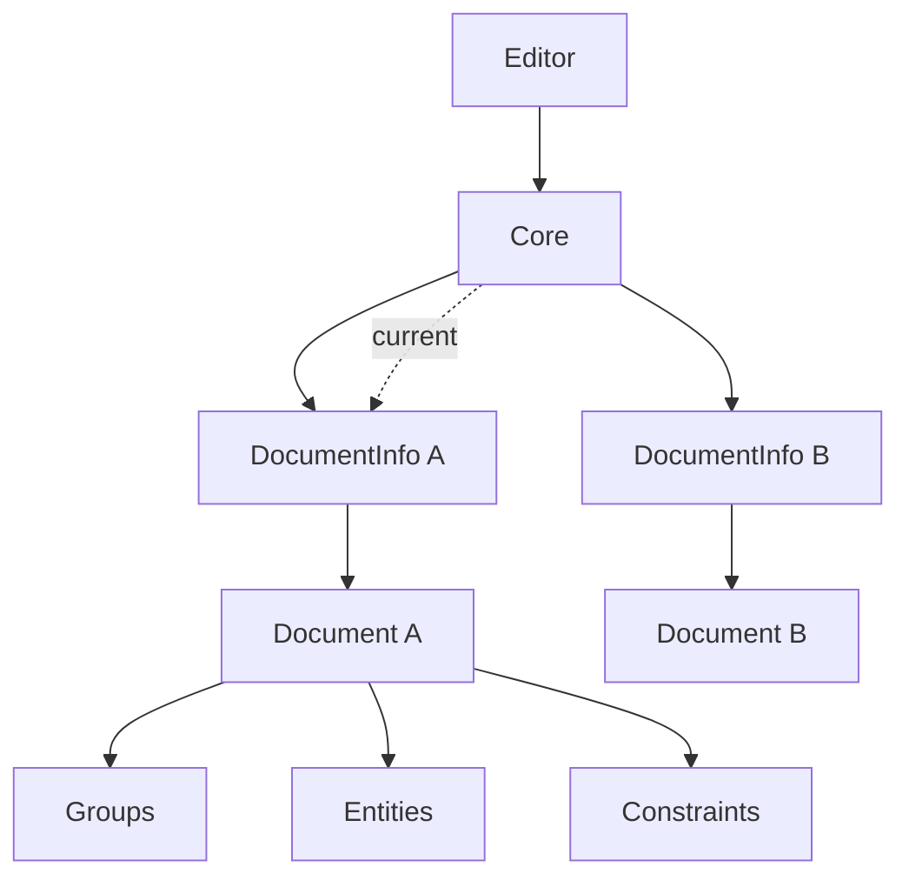

# Core 与 Document 关系（简要）

本文说明本项目中 `Core`、`Document` 的职责与数量关系。

## 一句话结论

- `Core` 是“调度与管理层”。
- `Document` 是“模型数据层”。
- 一个 `Core` 可管理多个 `Document`，但同一时刻只有一个“当前文档”。

## 职责划分

### Core 控制什么

- 当前文档/当前 group 的上下文切换
- Tool 生命周期（`tool_begin` / `tool_update`）
- 重建流程触发（`rebuild`）
- 历史操作（undo/redo）与保存状态

代码入口：`src/core/core.hpp`, `src/core/core.cpp`

### Document 控制什么

- 模型数据容器：`groups` / `entities` / `constraints`
- 按 group 顺序执行更新：generate -> solve -> update solid model
- 序列化/反序列化

代码入口：`src/document/document.hpp`, `src/document/document.cpp`

## 数量关系

- `Editor` 通常持有 1 个 `Core`（当前窗口会话）。
- `Core` 内部持有 `m_documents`（可多文档）。
- 每个 `DocumentInfo` 持有 1 个 `m_doc`（即 1 个 `Document`）。
- `Core` 通过 `m_current_document` 指向“当前活动文档”。

## 一个 Core 如何拥有多个 Document

- 新建文档：点击顶部“新建文档”按钮（带 `+` 的文件图标）会向 `Core` 添加一个新的 `DocumentInfo + Document`。
- 打开文档：`Open existing document` 也会向 `Core` 增加一个文档实例。
- 切换当前文档：通过底部文档标签切换时，仅改变 `m_current_document`，不会销毁其他已打开文档。
- 关闭文档：关闭某个标签时，`Core::close_document(...)` 从 `m_documents` 移除对应文档。

## 结构图（简化）



## 常见访问链路

```cpp
auto &doc = m_core.get_current_document();      // 当前 Document
auto &group = doc.get_group(m_core.get_current_group()); // 当前 Group
```

上面这条链路就是 UI 操作进入模型层时最常见的入口。
